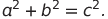
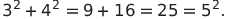

# Special Pythagorean triplet
#### Problem 9
A Pythagorean triplet is a set of three natural numbers, `a < b < c`, for which,



For example



There exists exactly one Pythagorean triplet for which a + b + c = 1000.
Find the product abc.

---
Remember to reduce value range of a, b, c
```python
def find_pythagorean_triplets(sum_triple):
    for a in range(1, int(sum_triple // 3)):
        for b in range(a, int(sum_triple // 2)):
            c = sum_triple - a - b
            if a * a + b * b == c * c:
                return (a, b, c), a * b * c
    return None, None
print(find_pythagorean_triplets(1000))
```

We can use brute force approach for this problem.